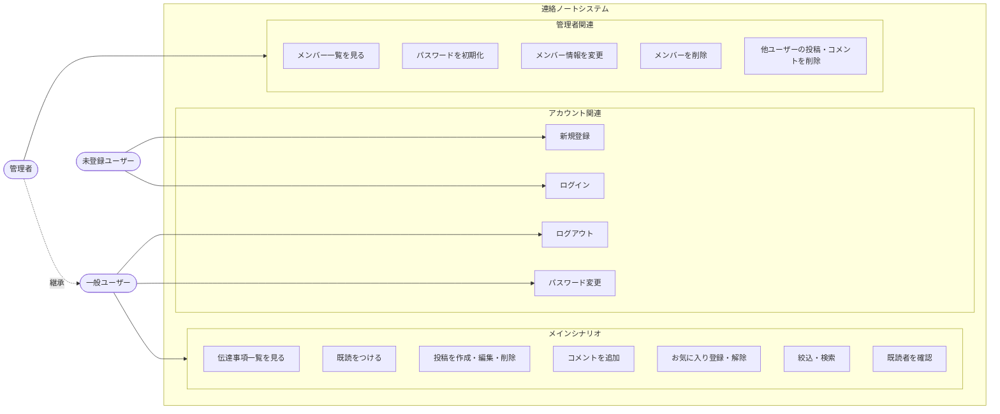
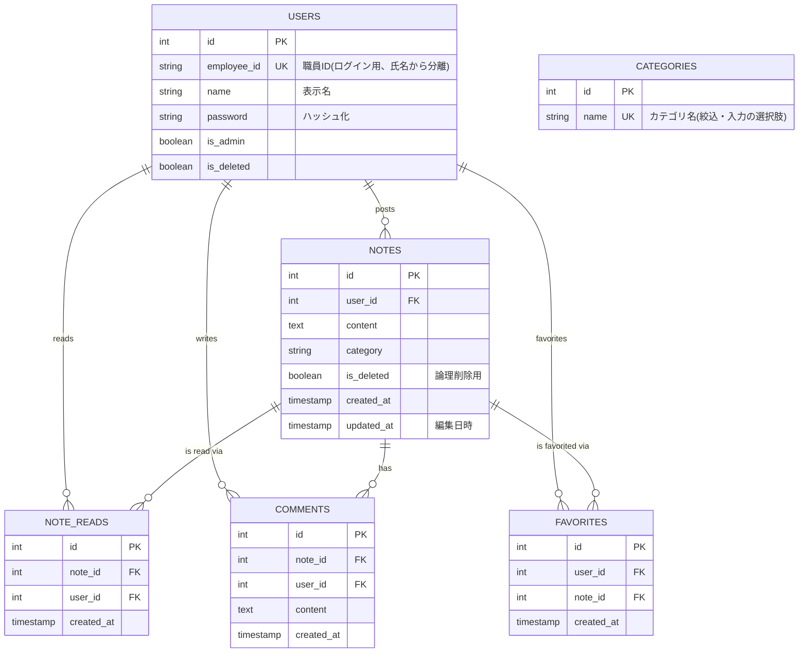

# 連絡ノートアプリ 要件定義書

エクセルの「誰でも書ける手軽さ」を残しつつ、「情報の埋没・検索性の低さ」を解決する、小規模組織向けの連絡ノートツール。

## 目次

1. [プロジェクト概要](#1-プロジェクト概要)
2. [機能要件](#2-機能要件)
3. [ユースケース](#3-ユースケース)
4. [画面構成](#4-画面構成)
5. [技術構成](#5-技術構成)
6. [DB設計](#6-db設計)
7. [非機能要件](#7-非機能要件)
8. [制約事項](#8-制約事項)
9. [受け入れ基準・テスト方針](#9-受け入れ基準テスト方針)
10. [将来の拡張候補](#10-将来の拡張候補)

---

## 1. プロジェクト概要

### 目的

小規模の組織内で使用する、連絡ノートアプリを開発する。エクセルの「誰でも書ける手軽さ」を残しつつ、「情報の埋没・検索性の低さ」という致命的欠点をシステムで解決するツールを目指す。

### 背景

ITリテラシーの低い現場では、どんなに優れたツールがあっても使いこなせず、結局はエクセルや手書きノートなどシンプルなツールが使われがちである。しかし、それらのツールは実装できる機能に限界があり、業務効率が落ちてしまう。そこで、ITリテラシーが低くても簡単に使用でき、既存ツールの非効率性を解決できるシステムとして本アプリケーションを開発する。

### 利用者・利用環境

- 利用者: 複数ユーザー(一般ユーザー / 管理者)
- 利用環境: Webブラウザ(PC) / ローカルネットワーク

---

## 2. 機能要件

### アカウント・認証関連

<b>F1: セルフサインアップ</b>

ユーザー自身が新規ユーザー登録(職員ID・氏名・パスワード設定)を行えること。

**受入基準**
- 職員ID・氏名・パスワードを入力して登録すると usersテーブルに登録され、自動的にログイン状態(メイン画面表示)となる。
- 職員IDが既存ユーザーと重複する場合はエラーメッセージを表示し登録しない(DB側もUNIQUE制約で担保)。
- パスワードはDB上にハッシュ化されて保存される。
- 必須項目の未入力・不整合時は適切なエラーメッセージを表示し登録しない。

セルフサインアップの流れだけでは管理者アカウントは作成されないため、初回起動時のDBシードなど、初期管理者を用意する手順を別途定める。

<b>F2: ログイン・ログアウト認証</b>

登録済みユーザー情報(職員ID・パスワード)で認証し、メイン画面へ遷移できること。ログアウトボタン押下で明示的にログアウトでき、一定時間無操作またはブラウザ終了後は自動的にセッションが終了すること。

**受入基準**
- 正しい職員ID・パスワードで認証成功、メイン画面へ遷移しセッションが維持される。
- 誤ったパスワードの場合は認証エラーメッセージが表示され、メイン画面へアクセスできない。
- 「ログアウト」押下でセッションが即座に破棄され、ログイン画面へリダイレクトされる。
- 未ログイン状態でメイン画面・管理者画面へ直接アクセスした場合、ログイン画面へ強制リダイレクトされる。

<b>F3: パスワード変更</b>

ログイン中のユーザーが自身のパスワードを変更できること。

**受入基準**
- 現在のパスワードと新しいパスワードを入力して実行すると、DB上のパスワードハッシュが更新される。
- 現在のパスワードが不一致の場合は変更が拒否され、エラーメッセージが表示される。
- 変更後、新しいパスワードで正常に再ログインできる。

### 伝達事項管理

<b>F4: 一覧表示</b>

作成済みの伝達事項を時系列で一覧表示できること。

**受入基準**
- メイン画面を開いた際、作成日時の新しい順(降順)で一覧表示される。
- 各投稿に「カテゴリ・テキスト・投稿者・投稿日時・既読人数・コメント数・お気に入り状態」が正しく反映されている。

<b>F5: 絞込検索</b>

キーワード検索およびカテゴリ選択による絞り込み表示ができること。画面遷移せずタブ切替で各条件の一覧を表示する。

**受入基準**
- 検索窓への入力で、タイトル・本文に対象文字列を含む伝達事項のみが非同期でリアルタイム抽出される。
- 「全体」「カテゴリ別」「お気に入り」タブ切替時、ページリロードなし(SPA)で一覧表示が切り替わる。
- 「カテゴリ別」タブ選択時はカテゴリ選択用のプルダウンが表示され、選択したカテゴリの伝達事項のみが一覧表示される(こちらもページリロードなし)。

カテゴリ選択用プルダウンの選択肢は`categories`テーブル(マスタ)から`GET /api/categories`で取得する。カテゴリの追加・編集・削除は本リリースのスコープ外とする(10章参照)。

<b>F6: 伝達事項の投稿・編集・削除</b>

ユーザーが新規伝達事項を作成できること。自身が投稿した伝達事項に限り更新・削除ができること。

**受入基準**
- 本文・カテゴリを入力して投稿すると notesテーブルに追加され、一覧の先頭に即座に反映される。
- 自身が投稿した伝達事項にのみ「編集」「削除」ボタンが表示され、更新・削除(論理削除)ができる。
- 他ユーザーの投稿には「編集」「削除」ボタンが表示されない(API直接実行でも拒否される)。
- 管理者アカウントの場合は、投稿者本人でなくても「削除」を実行できる(不適切投稿への運用対応)。

論理削除の実現にあたっては、notesテーブルにis_deletedカラムを持たせる(6.DB設計を参照)。

<b>F7: お気に入り登録</b>

後で見返したい伝達事項を個人ごとに「お気に入り」登録・解除・一覧表示できること。

**受入基準**
- 「お気に入り」アイコン押下で favoritesテーブルに登録され、アイコンがアクティブ状態になる。
- 再度押下で登録が解除され、favoritesテーブルから削除される。
- お気に入り状態はユーザーごとに独立して管理され、他ユーザーに影響しない。

### インタラクション・閲覧状況管理

<b>F8: 既読者の確認</b>

各伝達事項の既読人数・既読者を一覧画面・詳細画面で確認できること。

**受入基準**
- 各投稿上に現在の「既読人数」が正しくカウントされる。
- 既読人数の表示をクリックすると、モーダルで既読者(ユーザー名)一覧が確認できる。

<b>F9: 既読状態の更新</b>

「確認」ボタン押下で、対象の伝達事項に対する自身のステータスを既読に更新できること。

**受入基準**
- 未読の伝達事項で「確認」を押すと note_readsにレコードが挿入され、「確認済み」表示に切り替わり既読人数が1加算される。
- 一度既読をつけた後は「確認済み」表示となり、重複して既読がつかない。
- 画面リロード後も「確認済み」の状態が保持される。

重複防止のため、note_reads(note_id, user_id)の組み合わせにDBレベルのユニーク制約を設ける。

<b>F10: コメント追記</b>

自身または他ユーザーが作成した伝達事項に対してコメントを追記できること。

**受入基準**
- 詳細画面・コメント欄からの送信で commentsテーブルに追加され、一覧末尾に即座に追記表示される。
- コメント投稿者の氏名・投稿日時が正しく表示される。

### メンバー・グループ管理(管理者)

<b>F11: メンバー管理</b>

管理者権限を持つユーザーが、ユーザー管理画面からグループメンバーの修正・削除を行えること。

**受入基準**
- 対象ユーザーの氏名変更を保存すると usersテーブルの情報が更新される。
- 削除ボタン押下時、「本当に削除しますか?」という確認ポップアップが表示される。
- 削除確定後、対象アカウントが無効化され、そのユーザーでの新規ログインが不可となる。

<b>F12: パスワード初期化</b>

管理者権限を持つユーザーが、対象ユーザーの一時パスワード発行・パスワード初期化を行えること。

**受入基準**
- 管理者アカウントでのログイン時のみ、ユーザー管理画面に「パスワード初期化」ボタンが表示される。
- 実行するとランダムな一時パスワードが生成され、対象ユーザーのDBパスワードがハッシュ化されて更新される。
- 処理完了時、モーダルで「対象ユーザー名」と「一時パスワード(コピーボタン付き)」が表示される。
- 発行後、対象ユーザーがその一時パスワードで正常にログインできる。
- 一般ユーザーのアカウントでは本機能へのアクセス・API実行が拒否される(403 Forbidden)。

---

## 3. ユースケース

破線+「継承」は、管理者が一般ユーザーの機能をすべて利用できることを表す。アクターからグループ枠への実線は、枠内の全ユースケースに対応することを示す。

### 1. メインシナリオ

- UC1-1. 伝達事項を見る(F4)
- UC1-2. 確認した伝達事項に既読をつける(F9)
- UC1-3. 新規伝達事項の作成・修正・削除をする(F6)
- UC1-4. 伝達事項にコメントをつける(F10)
- UC1-5. お気に入り登録・解除をする(F7)
- UC1-6. キーワード検索・カテゴリ毎・お気に入りの一覧表示をする(F5, F7)
- UC1-7. 既読者を確認する(F8)

### 2. アカウント関連のシナリオ

- UC2-1. 新規ユーザー登録をする(F1)
- UC2-2. ログインする(F2)
- UC2-3. ログアウトする(F2)
- UC2-4. パスワードの変更をする(F3)

### 3. 管理者アカウント関連のシナリオ

- UC3-1. メンバー一覧を見る(F11)
- UC3-2. パスワードを初期化する(F12)
- UC3-3. メンバー情報を変更する(F11)
- UC3-4. 退職したユーザーを削除する(F11)
- UC3-5. 他ユーザーが投稿した伝達事項・コメントを削除する(F6 拡張)

---

## 4. 画面構成

### ①ログイン画面

ログイン及び新規ユーザー登録ボタンを配置。ログイン成功後、②へ遷移。

### ②閲覧・入力画面

- 既読ボタン押下で閲覧状況を更新できる。押下と同時に、その場(画面遷移なし)で既読人数の表示が更新される。
- 新規作成ボタン押下で入力画面が展開される(アコーディオン形式)。このボタンは「全体」タブ表示時のみ表示し、「カテゴリ別」「お気に入り」表示時は表示しない。
- コメント(件数)ボタン押下で、既存コメント全件と入力欄が展開される(アコーディオン形式)。
- 既読人数が表示され、クリックするとモーダルで既読者が確認できる。
- お気に入り登録ボタン押下でお気に入りに登録できる。
- ヘッダーのタブ選択で、一覧・カテゴリ別・お気に入りの絞り込み表示ができる(画面遷移なし)。「カテゴリ別」選択時はカテゴリ選択用のプルダウンが表示され、選択したカテゴリの投稿のみが一覧表示される。
- 検索バーへの入力・検索ボタン押下で該当するもののみ表示される(画面遷移なし)。
- 管理者ログイン時のみ、ユーザー情報管理画面へのリンクが表示される。

### ③ユーザー情報管理画面

管理者のみアクセス可能。メンバー一覧・修正・削除・パスワード初期化を行う。

---

## 5. 技術構成

| レイヤー | 技術 |
|---|---|
| バックエンド | Java 21 / Spring Boot / Gradle |
| フロントエンド | React / Vite |
| DB | PostgreSQL / Docker |

---

## 6. DB設計

NOTE_READSは`(note_id, user_id)`、FAVORITESは`(user_id, note_id)`にそれぞれUNIQUE制約を設け、重複登録をDB側で防止する。

NOTESの`category`は固定の選択肢(enum等)を持たせず、DB上は自由記載の文字列として保持する。運用中にカテゴリの追加・変更が発生してもDBスキーマ変更を伴わないようにするための設計判断であり、入力・絞り込み時の選択肢(プルダウン等)はアプリケーション側で管理する。

カテゴリの選択肢自体は`categories`テーブル(マスタ)で管理し、`GET /api/categories`で取得する。ただし`notes`とはFK制約を結ばず、`notes.category`は引き続き自由記載の文字列カラムとして保持する(運用中にカテゴリの追加・変更があっても`notes`の既存データや外部キー整合性に影響を与えないための設計判断)。カテゴリの追加・編集・削除機能は10章「将来の拡張候補」を参照。

| テーブル | 役割 |
|---|---|
| `users` | ユーザーの登録情報や権限を管理する |
| `notes` | 投稿された伝達事項そのものを管理する |
| `categories` | 伝達事項カテゴリの選択肢(マスタ)を管理する |
| `note_reads` | 「どの投稿を」「誰が」既読にしたかの履歴を記録する |
| `comments` | 「どの投稿に」「誰が」「どんなコメントを」「いつ」書いたかを保存する |
| `favorites` | 「誰が」「どの投稿を」お気に入り登録しているかのリスト |

---

## 7. 非機能要件

### パフォーマンス・応答性

画面遷移を伴わない操作(一覧表示・既読ボタン押下など)の応答を1秒以内(目安)に完了させる。

### セキュリティ

- パスワードは平文で保存せず、ハッシュ化してDBに保存する。
- 未ログインユーザーが直接URLを入力しても、メイン画面や管理者画面にアクセスできないようにする。
- 管理者権限のない一般ユーザーが、管理者用APIを直接呼び出しても拒否する。
- 無操作状態が30分継続した場合、セッションを自動的に終了しログイン画面へ遷移させる。

本アプリは金銭処理を伴わない社内向けツールであるため、無操作タイムアウトは30分を目安とする(一般的な業務システムの目安は15〜30分、リスクの高い取引系システムでは2〜5分程度とされる)。

### 運用性・保守性

エラー発生時には、バックエンド(Java)側でログを出力し、原因追究ができるようにする。

### 拡張性・データの整合性

投稿やコメントが削除されても、DBの整合性が崩れない設計にする(論理削除で保持する)。

---

## 8. 制約事項

- 動作環境・ターゲット: PCブラウザを想定(スマートフォン対応は対象外)。「Google Chrome 最新版」を推奨環境とする。
- 外部連携: 外部サービスとのAPI連携は行わず、システム単体で完結する設計とする。
- 認証・認可方式: 認証はSpring Securityによる自前のセッション方式管理とする。

---

## 9. 受け入れ基準・テスト方針

- 各機能要件に定めた受入基準を満たすことを、単体・結合テストで確認する。
- 非機能要件については、可能な範囲で簡易的な確認(主要操作の応答時間の目視確認等)を行う。
- バックエンド: JUnit 5によるService層の単体テスト、MockMvcによる主要APIの結合テストを実装する。
- フロントエンド: 主要ユースケースシナリオに基づく手動結合テストを実施する。
- テストで指摘された不具合は、重要度に応じて修正のうえ再テストを行う。

---

## 10. 将来の拡張候補

1. 個人管理型のWebサービスとして展開する場合は、SSOやOAuth認証を導入する。
2. 確認漏れ防止として、未読投稿が一目でわかる装飾(未読バッジ、「未読のみ表示」フィルターなど)を装備する。
3. 伝達事項やコメントに画像・PDFなどを添付・表示する機能を装備する。
4. 必要に応じてグループ共通の招待コード等による簡易制限を設ける。
5. モバイル・タブレット端末への対応(レスポンシブWebデザインの導入)。
6. 投稿の下書き保存機能を装備する。（今回は画面遷移を最小限にしたシンプルな運用としたいため、本リリースのスコープには含めず。）
7. `notes.updated_at`の自動更新を、アプリケーション層での明示的な設定ではなくDBトリガー(UPDATE時にupdated_atをnow()に更新するplpgsql関数)で行う方式に切り替える。現状はnotesテーブルへの書き込み経路がバックエンドAPI一本のためアプリ層管理で十分だが、将来的に別サービスやバッチ処理などAPIを介さずDBを直接更新する経路が増えた場合には、DBトリガーの方が更新日時の整合性を確実に担保できる。
8. カテゴリマスタ(`categories`)の追加・編集・削除を行う管理者向けAPI・画面を実装する。認証・認可(Spring Security)実装後に、ユーザー管理(F11/F12)と同様の管理者専用機能として対応する予定。
